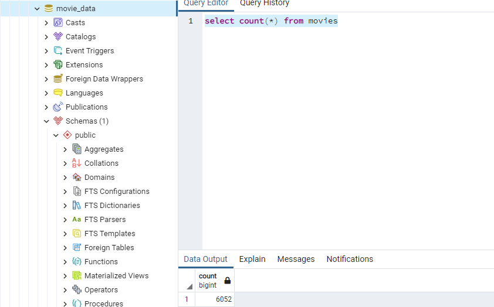
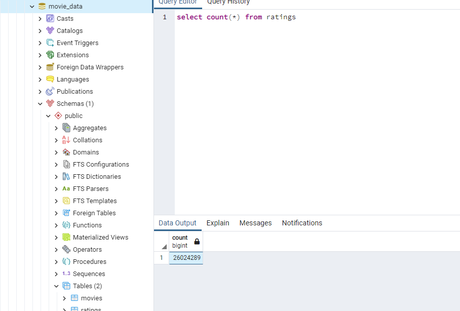

# Movies-ETL
---
# ETL pipeline on movie data using Python and postgreSQL

## Overview
---
This project consisted on a automated Extraction, Transformation and Load pipeline. This ETL extracted movie data from wikipedia, kaggle, and MovieLens to clean it, transform it, and merge it using Pandas. The product was a merged table with movies and ratings loaded to PostgreSQL.

## Resources

# Data sources:

* movies_metadata.csv
* ratings.csv
* wikipedia_movies.json

## Software:

* Python
* PostgreSQL
* Pandas
* SQLAlchemy
* Regular Expressions

## Results

## Summary

The pipeline was created under the following assumptions:

*I was able to join the wikipedia, kaggle, and ratings movie data on the IMDB ID column.
*The wikipedia dataset didn't have a IMDB ID, so I had to extract it from the url link given.
*Each dataset had to be cleaned on their own because they had overlapping columns, suck as 'Director' and 'Directed By', unecessary columns, many null values, TV shows,         utliers, duplicates, incorrect data types, formatting, and other errors.
* The wikipedia movie data was in json format.
* Not every every movie had a rating for each rating level.
* The ratings dataset had more than 26 million entries which generated a time constraint and a processing data challenge.
